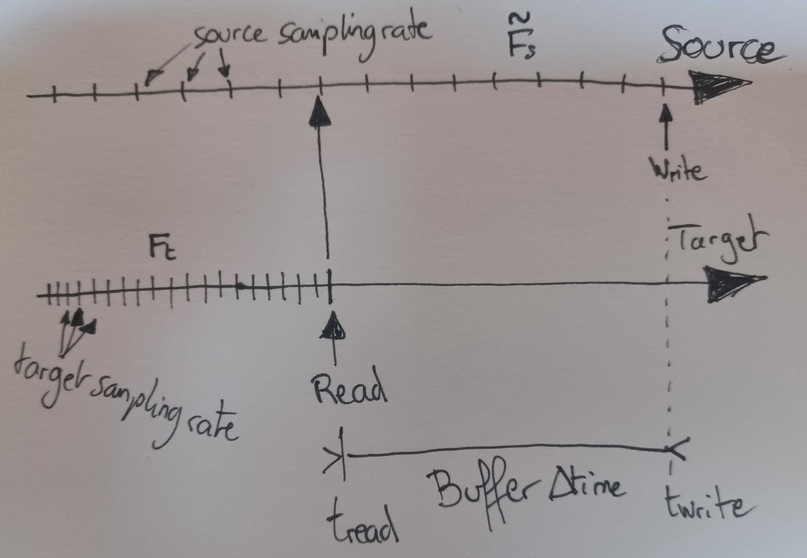

In this new iteration, I'll try to implement a full duplex communication by installing a microphone on the Peripheral side and stream it to the Central, which will stream it back again to the Peripheral.

The microphone stream is 16KHz mono so I'll probably have to write some kind of intermediate "upsampling" ISampleSource that will interpolate samples into a 44.1KHz stereo stream for playing back... 😕

Also, I'll try to fix the replay issue with the audio buffering on the Peripheral side that gets starved of packets...

# Second Amplifier

We need to install a 2nd MAX98357A to properly play both channels.

It's quite easy to configure them so one is the left channel while the other is the right channel if we follow the specs indicated in **Table 5** of the MAX98357A specs sheet:

* Connect the SD_Mode pin to **SD_Mode > 1.4V** (so VCC is fine) to make the chip select the **left** channel
* Connect the SD_Mode pin to **0.77V > SD_Mode > 1.4V** to make the chip select the **right** channel
  * We do that by connecting to VCC through a 220 KOhms resistor to complement the internal 100 KOhms pull-down which brings a voltage to 3.3 * 100000 / (100000 + 220000) = 1.03V
* Otherwise, both amplifiers share the same BCLK, WS and data line on pins 26, 25 and 22 respectively.

# Connecting a Microphone

I'm still waiting for my INMP411 to arrive so I'll be using a pre-amplified MAX9814 mic connected to the ADC in the meantime.
I'm using I2S to sample the ADC and write to memory using the DMA (another use of the excellent super small code by Atomic14), it's quite easy to use to fill our buffer with unsigned 12-bits samples that are later reconfigured into signed 16-bits stereo samples, as the I2SInput acts as an ISampleSource.

I had fun sampling the microphone at 44KHz and feeding it as a source directly to the I2S output speakers and it was hell of a ride in reverb valley! :grin:

**NOTE:** I tried using an analogRead() to drive the digital volume with a potentiometer but the function hangs the processor! Apparently, you can't use manual ADC reading while I2S is enabled. The same way you can't use ADC2 pad 2 while WiFi is enabled... Bummer!

## Using the INMP411

They finally arrived! It's quite easy to take the I2SInput code and modify it to accommodate regular I2S transmission instead of ADC reading (once again, thanks to Atomic14 for taking care of the gritty details!).

Since the speakers and the microphone use different data rates, I cannot use the same BCLK, WS and data lines so I used pins 18, 19 and 21, respectively.

# Trying other WiFi Channels

I read somewhere that one should fiddle with different WiFi channel settings to minimize interference with the home WiFi network so I recompiled Central/Peripheral modules with channels 1 to 8 and tried to see if the rate of packets loss changed but I didn't notice any real difference...

**Update:** Today I switched to channel 11 and I got much fewer packets lost ~1 or 2 and sometimes more but very rarely!

**NOTE: ** it also suddenly occurred to me that I could use 2 channels: 1 for the Central:arrow_right:Peripheral and another one for the Peripheral:arrow_right:Central but the WiFi channel setup seems to be global to the board...

## Using Free Channels

I didn't know the importance of using a free WiFi channel (i.e. not used by your home network or something else) until I started having lots of packets lost and ESP_NOW_ERR_NO_MEMORY issues due to packets piling up in the sending queue without having a chance to be broadcast (probably due to other packets from the house network taking their place instead).

So I finally opted to perform a "quick" scan of all the channels before starting the device and issuing an error if the channel I selected is already in use!

I lost too much time with annoying "out of my hands" issues already and I need something reliable!

# Full Duplex

I tried sending the microphone to the Central and make the Central send it back again (after sampling scaling) and although I'm hitting some replay rates/buffering issues (cf. the main problem of [Buffer Underrun Issue](#Buffer Underrun Issue)), full duplex transmission seems to be working!

## Packets Lost

I noticed that sending hi-fi packets at 44.1KHz suffered from heavy packets lost issues (over 7% lost) but the rate decreased to less than 1% when I downgraded to only 22KHz.

So the goal seems to be hitting 44KHz sampling rate while sending compressed data "as if" we were sampling at 22KHz.
We'll have to investigate some CODECs (FLAC seemed to be a promising solution).

**NOTE:** After an upgrade of the receiver/transmitters using tasks instead of timers, the packets loss fell down dramatically, even at 44KHz! It went from 7% (~50 of the 720 received packets) down to a max of 0.5% (~4 packets)!
Also, it falls even lower if I disable the full-duplex. So it'd seem broadcasting packets in both ways introduces interferences... Maybe there's a way to prevent that?

## Fixing the Lost Packets

On the Peripheral device, it's quite common to lose incoming packets and even though they're featuring a "sample slot ID" that allows us to skip missed packets and insert the ones we get at the proper place in the audio stream, apparently it's quite bad to leave "blank packets".

* I tried to fill the missing packets with 0 but I got some horrible scratches
* I tried to duplicate the last packet into the missing packet slots but also got horrible scratches
* Current state: Playing the packets "as they arrive" seems to be an ok solution but since we're using a circular buffer, the player is faster than the received packets and so we go over the replay buffer and catch up with the "writer" several times, resulting in an overall bad sound...

We could try:

* Buffering quite a lot of samples ahead (at the cost of delay) and reducing the replay rate when we catch up too quickly

* Fill the lost packet slots with an interpolation between last and first new received values?

* Block the player until data arrive (which is what is usually done, as stated by Phil Schatzman in one of his [blog posts](https://www.pschatzmann.ch/home/2022/04/25/low-latency-streaming-of-audio-data/))

  > It is thus far easier to send the data **as fast as possible** and just **block on the receiving** system when the buffer is full.
  > This approach works well with all recorded data or data which is created via DSP algorithms. This is by the way also how A2DP works!

Scratches when feeding packets to the I2S as soon as they're received

Scratches when using a task monitoring I2S events requesting samples

  ==> We end up catching up with the unsteady flow of received packets?

  ==> Even reducing the play rate down to 22KHz instead of 22050Hz to give a chance to the receiver to take some advance doesn't work...

# Buffer Underrun Issue

On top of packet loss issues, there's the more general underlying issue of having a source and a player of samples not running at the exact same pace.

Whatever we do, we will **never** be at the same pace whether we're considering a local or remote source, unless the very specific case when the source and the player are sampled in the same code function.

So the general problem should be formulated like this:

* We have a target replay frequency $F_t$ that will require samples that should **always** be available
  * Whatever we do, we always want to accommodate this "master time line" and this frequency
* We have a **theoretical** source frequency *Fs* that will provide some samples at a given rate
  * This is the **ideal frequency** that we expect our source to be providing its samples at
* We have a third frequency, the actual source channel frequency $\tilde{F_s}$ that should (ideally) provide some samples at frequency $F_s$ but is slightly off:
  * If the source is local, it could be driven by an (imperfect) timer that is not quite the required theoretical frequency
  * If the source is remote (and no packets are lost), it will dictate the frequency by counting how many packets we received per second

In fact, it's better to ignore sampling rates altogether and see the Source and Target as **timelines** where an imperfect (i.e. discretized) signal is being played:

The Source and Target timelines are **synchronized** but there's a delay between the source being buffered with new samples and the target being read. This is just so the source has enough time to store/unpack/fix new samples before they are requested by the target (player).

So the idea is not to think in terms of samples anymore, but in terms of seconds: how long do we need our buffers to be? How far apart should they be?

## Determining $\tilde{F_s}$

It's easy to determine the source frequency $\tilde{F}s$ by determining how many samples  we received every second:
$$
\tilde{F_s} \approx \frac{N_s}{\Delta_t}
$$
Where $N_s$ is the amount of samples received during the time interval $\Delta_t$.

**NOTE:** In practice, I think it will be better to use a running average of that frequency, to avoid large changes in replay rate from 1 second to the next!

🔷 Example with a timer:

* Imagine we received too many samples over a 1s interval, we then have $\tilde{F_s} > F_s$ and we must **compact** these samples into the 1s interval
* Imagine we received not enough samples over a 1s interval, we then have $\tilde{F_s} < F_s$ and we must **expand** these samples into the 1s interval

🔷 Example with some packets:

* We receive some packets with a timestamp indicating the time slot where to store the packet
* But this timestamp is running at the remote device's clock time, which is different from our own time
* We can determine the frequency $\tilde{F_s}$ at which the remote device is working simply by counting how many packets (or samples) we received during our own time interval
* In the same manner with the timer example above, depending whether we receive too many/few packets per second, we compact/expand these packets into the 1s interval

## Sampling at $F_t$

Using $\tilde{F_s}$ we can then easily sample the source signal at the requested target frequency $F_t$ using a linear interpolation of the incomplete signal.

# CODECs

## Lossless

* FLAC ==> 50% to 70% original file size

## Lossy

* Opus is Vorbis's successor
* AAC from Fraunhofer (used in MP4), better than MP3
